# 📊 AVEVA-PI Database Schema ERD

**Generated:** October 30, 2025
**Database:** SQLite (`app.db`)
**Total Tables:** 15 (14 aplikasi + 1 internal)

## 🏗️ Entity Relationship Diagram

```mermaid
erDiagram
    %% AVEVA-PI Database ERD - Actual Schema
    %% Generated: October 30, 2025
    %% Based on actual SQLite database schema

    %% Direction: Left to Right for cleaner layout
    direction LR

    %% Core Business Entities
    data_sources {
        TEXT id PK
        TEXT name "NOT NULL"
        TEXT plugin "NOT NULL"
        TEXT database_type
        TEXT config "NOT NULL"
        TEXT connection_status "DEFAULT 'unknown'"
        DATETIME last_tested_at
        TEXT test_status "CHECK (success/failed/pending)"
        TEXT test_error_message
        BOOLEAN active "DEFAULT 1"
        DATETIME created_at "DEFAULT CURRENT_TIMESTAMP"
        DATETIME updated_at "DEFAULT CURRENT_TIMESTAMP"
    }

    triggers {
        TEXT id PK
        TEXT name "NOT NULL"
        TEXT type "NOT NULL"
        TEXT config "NOT NULL"
        BOOLEAN active "DEFAULT 1"
        TEXT data_source_id FK
        DATETIME created_at "DEFAULT CURRENT_TIMESTAMP"
        DATETIME updated_at "DEFAULT CURRENT_TIMESTAMP"
    }

    trigger_groups {
        TEXT id PK
        TEXT name "NOT NULL"
        TEXT description
        TEXT execution_mode "DEFAULT 'parallel'"
        DATETIME created_at "DEFAULT CURRENT_TIMESTAMP"
        DATETIME updated_at "DEFAULT CURRENT_TIMESTAMP"
    }

    trigger_group_members {
        INTEGER id PK "AUTOINCREMENT"
        TEXT group_id "NOT NULL, FK"
        TEXT trigger_id "NOT NULL, FK"
        DATETIME created_at "DEFAULT CURRENT_TIMESTAMP"
    }

    %% AI & Communication
    ai_triggers {
        TEXT id PK
        TEXT type "NOT NULL DEFAULT 'ai'"
        TEXT prefix "NOT NULL"
        TEXT name "NOT NULL"
        TEXT description
        BOOLEAN enabled "DEFAULT 1"
        INTEGER usage_count "DEFAULT 0"
        DATETIME last_used
        DATETIME created_at "DEFAULT CURRENT_TIMESTAMP"
        DATETIME updated_at "DEFAULT CURRENT_TIMESTAMP"
    }

    whatsapp_status {
        INTEGER id PK "DEFAULT 1"
        BOOLEAN is_ready "DEFAULT 0"
        BOOLEAN is_initializing "DEFAULT 0"
        TEXT bot_number
        TEXT phone_number
        TEXT bot_id
        TEXT qr_data
        DATETIME last_update "DEFAULT CURRENT_TIMESTAMP"
        INTEGER reconnect_attempts "DEFAULT 0"
        DATETIME created_at "DEFAULT CURRENT_TIMESTAMP"
        DATETIME updated_at "DEFAULT CURRENT_TIMESTAMP"
    }

    messages {
        TEXT id PK
        TEXT type "NOT NULL"
        TEXT content
        TEXT sender
        TEXT recipient
        TEXT status "DEFAULT 'sent'"
        DATETIME processed_at
        TEXT metadata
        DATETIME created_at "DEFAULT CURRENT_TIMESTAMP"
    }

    contacts {
        TEXT id PK
        TEXT name
        TEXT phone "UNIQUE"
        TEXT metadata
        DATETIME created_at "DEFAULT CURRENT_TIMESTAMP"
        DATETIME updated_at "DEFAULT CURRENT_TIMESTAMP"
    }

    outgoing_messages {
        INTEGER id PK "AUTOINCREMENT"
        TEXT recipient "NOT NULL"
        TEXT message "NOT NULL"
        TEXT type "DEFAULT 'manual'"
        TEXT status "DEFAULT 'pending'"
        DATETIME sent_at
        TEXT error_message
        INTEGER retry_count "DEFAULT 0"
        DATETIME created_at "DEFAULT CURRENT_TIMESTAMP"
    }

    %% Configuration & Settings
    query_presets {
        TEXT id PK
        TEXT name "NOT NULL"
        TEXT query_template "NOT NULL"
        TEXT variables
        BOOLEAN is_default "DEFAULT 0"
        INTEGER usage_count "DEFAULT 0"
        DATETIME created_at "DEFAULT CURRENT_TIMESTAMP"
        DATETIME updated_at "DEFAULT CURRENT_TIMESTAMP"
    }

    system_settings {
        TEXT id PK
        TEXT category "NOT NULL"
        TEXT key "NOT NULL"
        TEXT value
        DATETIME created_at "DEFAULT CURRENT_TIMESTAMP"
        DATETIME updated_at "DEFAULT CURRENT_TIMESTAMP"
    }

    %% Authentication & Security
    users {
        TEXT id PK "UUID DEFAULT"
        TEXT username "UNIQUE NOT NULL"
        TEXT password_hash "NOT NULL"
        TEXT full_name
        TEXT email
        TEXT role "DEFAULT 'admin'"
        TEXT created_by FK
        DATETIME created_at "DEFAULT CURRENT_TIMESTAMP"
        DATETIME last_login
        BOOLEAN is_active "DEFAULT 1"
        INTEGER login_attempts "DEFAULT 0"
        DATETIME locked_until
    }

    audit_logs {
        TEXT id PK "UUID DEFAULT"
        TEXT user_id FK
        TEXT action "NOT NULL"
        TEXT details
        TEXT ip_address
        TEXT user_agent
        DATETIME timestamp "DEFAULT CURRENT_TIMESTAMP"
    }

    sessions {
        TEXT id PK "UUID DEFAULT"
        TEXT user_id "UNIQUE, FK"
        TEXT token_hash
        DATETIME expires_at
        DATETIME created_at "DEFAULT CURRENT_TIMESTAMP"
        TEXT ip_address
        TEXT user_agent
        BOOLEAN is_active "DEFAULT 1"
    }

    %% Relationships - Organized to minimize crossing
    data_sources ||--o{ triggers : "has_many"
    triggers ||--o{ trigger_group_members : "belongs_to"
    trigger_groups ||--o{ trigger_group_members : "has_many"

    users ||--o{ users : "created_by (self-ref)"
    users ||--o{ audit_logs : "generates"
    users ||--|| sessions : "has_one (unique)"
```



## 📋 Table Summary

### **🏢 Core Business (4 tables)**
| Table | Description | Key Fields |
|-------|-------------|------------|
| `data_sources` | External data connections | id, name, plugin, config |
| `triggers` | Individual query triggers | id, name, type, data_source_id |
| `trigger_groups` | Trigger groups for batch execution | id, name, execution_mode |
| `trigger_group_members` | Many-to-many trigger ↔ groups | group_id, trigger_id |

### **🤖 AI & Communication (5 tables)**
| Table | Description | Key Fields |
|-------|-------------|------------|
| `ai_triggers` | AI chat triggers | id, prefix, name, usage_count |
| `whatsapp_status` | Bot connection status | id, is_ready, bot_number |
| `messages` | WhatsApp message logs | id, sender, content, status |
| `contacts` | WhatsApp contacts | id, name, phone (unique) |
| `outgoing_messages` | Outgoing message queue | id, recipient, message, status |

### **⚙️ Configuration (2 tables)**
| Table | Description | Key Fields |
|-------|-------------|------------|
| `query_presets` | Saved query templates | id, name, query_template |
| `system_settings` | Key-value settings | category, key, value |

### **🔐 Authentication & Security (3 tables)**
| Table | Description | Key Fields |
|-------|-------------|------------|
| `users` | User accounts | id (UUID), username, password_hash, role |
| `audit_logs` | Activity audit logs | user_id, action, timestamp |
| `sessions` | JWT sessions (unique per user) | user_id (unique), token_hash, expires_at |

### **🔧 Internal SQLite (1 table)**
| Table | Description |
|-------|-------------|
| `sqlite_sequence` | Auto-increment counters |

## 🔗 Foreign Key Relationships

```
data_sources (1) ──── (many) triggers
triggers (many) ──── (many) trigger_group_members
trigger_groups (1) ──── (many) trigger_group_members
users (1) ──── (many) users (self-reference: created_by)
users (1) ──── (many) audit_logs
users (1) ──── (1) sessions (unique constraint)
```

## 📈 Performance Indexes

- `idx_data_sources_plugin` - Plugin-based filtering
- `idx_data_sources_active` - Active connections
- `idx_triggers_active` - Active triggers
- `idx_triggers_data_source` - Data source relationships
- `idx_users_username` - User authentication
- `idx_users_is_active` - Active users
- `idx_audit_logs_user_id` - User activity logs
- `idx_audit_logs_timestamp` - Time-based audit queries
- `idx_sessions_user_id` - Session management
- `idx_sessions_expires_at` - Session cleanup
- `idx_sessions_is_active` - Active sessions
- `idx_outgoing_messages_status` - Message queue status
- `idx_outgoing_messages_recipient` - Recipient-based queries
- `idx_outgoing_messages_created_at` - Time-based message queries

## 🎯 Key Features

- **UUID Primary Keys** for users, audit_logs, sessions
- **Foreign Key Constraints** with CASCADE/SET NULL
- **CHECK Constraints** for data validation
- **AUTOINCREMENT** for sequential IDs
- **UNIQUE Constraints** for business rules (sessions.user_id = unique per user)
- **Self-Referencing Users** (created_by relationship)
- **WAL Mode** for better concurrency
- **Comprehensive Indexing** for performance

---

*Database schema extracted from actual SQLite database on October 30, 2025*